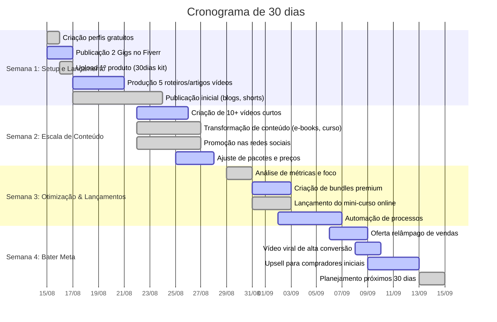

# Resumo Executivo  
O plano de 30 dias visa transformar o personagem virtual **Isabella** em uma fonte multicanal de receita. Priorizaremos **serviços sob demanda** (Fiverr) e **produtos digitais** (Gumroad/Hotmart), apoiados por conteúdo gratuito de alto impacto em YouTube Shorts, TikTok, Reels e blog. A estratégia foca em nichos com alto engajamento: **moda, beleza, pet e casa** – categorias que dominam o TikTok Shop Brasil. Por exemplo, moda e beleza representam ~50% e 46% das vendas no TikTok Shop. Além disso, segundo o relatório da Fiverr, a demanda por vídeo curto gerado por IA cresceu *+265%* (UGC ads) e por conteúdo de vídeo faceless para YouTube cresceu +239%, confirmando a oportunidade de oferecermos vídeos publicitários dinâmicos. 

 *Exemplo de criadora de conteúdo de moda/beleza: alta capacidade de engajamento visual e storytelling digital.* Este ambiente favorece nossa “máquina de receita”: cada vídeo curto publicado direciona tráfego para produtos e gigs (aproveitando SEO e afiliados), gerando vendas contínuas mesmo em descanso. As metas financeiras para 30 dias foram definidas em três cenários: **conservador** (~R\$2–3 mil), **realista** (~R\$5–8 mil) e **agressivo** (~R\$12–15 mil) de receita acumulada, considerando vendas de serviços (Fiverr) e produtos digitais (Gumroad/Hotmart). Esses valores são plausíveis dado o “discovery commerce” em alta – o TikTok Shop cresceu 102× no primeiro ano no Brasil – e a tendência de empresas adotarem influencers sintéticos para converter em vendas. 

# Mapa de Monetização (atividades e ofertas)  
| **Ativo / Oferta**               | **Persona-alvo**                          | **Detalhe da Oferta**                                | **Preço (R\$)**     | **Plataforma**       | **Material Necessário**                    | **Tempo para Venda**     | **CTA Inicial**                     |
|---------------------------------|--------------------------------------------|------------------------------------------------------|---------------------|---------------------|--------------------------------------------|--------------------------|-------------------------------------|
| **Avatar IA personalizado**     | Agências, lojas virtuais, marketing B2C     | Criação de modelo virtual hiper-realista (Imagem)    | 150 – 300          | Fiverr (Serviço)    | Ilustração do cliente, portfólio da Isabella | 1–2 dias                 | “Peça seu avatar IA”                |
| **Vídeo curto publicitário (faceless)** | Pequenas empresas e infoprodutores         | Vídeo 10–15s para anúncio de produto/serviço         | 50 – 150 / vídeo   | Fiverr (Serviço)    | Roteiro, imagens/video da Isabella, editor   | 1–2 dias                 | “Encomende vídeo sob medida”        |
| **Pacote de Prompts (IA)**      | Copywriters, designers, entusiastas IA      | Coleção de prompts otimizados para gerar conteúdo    | 47 – 97            | Gumroad, Etsy (Digital) | E-book em PDF ou Pack zip com exemplos         | 3–7 dias                 | “Baixe pacote de prompts”           |
| **Pacote de Templates/Legendas**| Empreendedores digitais                     | Calendário + templates de posts/legendas (30 dias)  | 27 – 47            | Gumroad, Hotmart    | PDF/Canva/E-books de templates              | 3–5 dias                 | “Adquira pacote de conteúdo”        |
| **Mini-curso video (Aulas)**    | Empreendedores, criadores de conteúdo       | Curso básico (5–10 módulos) sobre IA em marketing   | 97 – 147           | Hotmart, Kiwify     | Vídeos gravados, PDF de slides              | 15–30 dias               | “Inscreva-se no curso completo”     |
| **Consultoria criativa IA**     | Agências e empresas PME                     | Sessões sob demanda (IA + estratégia)                | 300 – 600 / pacote | Upwork, Workana     | Apresentação institucional, exemplos       | 7–14 dias                | “Contrate consultoria IA”           |
| **Conteúdo de Afiliados**       | Seguidores e visitantes                     | Indicação de softwares IA, cursos e ferramentas      | – (comissão)       | YouTube, Blog, Pinterest | Links de afiliados, resenhas, vídeos      | Imediato/sempre ativo    | “Veja as indicações abaixo”         |
| **YouTube/Shorts (AdSense)**    | Audiência geral de nicho (moda/beleza)      | Shorts educativos ou de demonstração de IA           | – (ads passive)    | YouTube (Gratuito)  | Vídeos curtos, títulos SEO                  | Imediato (monetização após 1k subs) | “Inscreva-se no canal”           |
| **Licenciamento de Arte (foto)**| Agências, criadores de conteúdo             | Venda de direitos de uso de imagens da Isabella      | 50 – 150 / licença | Etsy (Digital)      | Fotos/vídeos da Isabella de alta res.        | 3–7 dias                 | “Adquira licença de uso”            |

# Calendário de Execução (15/08 a 15/09)  

| **Dia**     | **Tarefas Principais**                              | **Responsável** | **Entrega**          | **Critério de Aceite**                        |
|-------------|-----------------------------------------------------|-----------------|----------------------|-----------------------------------------------|
| 15/08 (Seg) | Configurar perfis (Fiverr, Gumroad, IG, etc.)       | Você/ChatGPT    | Perfis ativos        | Links funcionando, descrição inicial pronta   |
| 16/08 (Ter) | Publicar Gigs no Fiverr; subir 1º produto no Gumroad | Você           | Gigs e produto online | Aprovação de publicação, revisão completa     |
| 17/08 (Qua) | Criar 5 roteiros de vídeo + 5 artigos SEO            | ChatGPT        | Textos finais         | Textos revisados, SEO aplicado               |
| 18/08 (Qui) | Gravar/editar 5 vídeos curtos (15–60s)              | Você/Video Editor | 5 vídeos prontos    | Qualidade profissional, CTA incluso           |
| 19/08 (Sex) | Publicar vídeos no YouTube Shorts, TikTok, Reels     | Você           | Vídeos publicados    | Publicados nas plataformas, descrições feitas |
| 20/08 (Sáb) | Criar 5 imagens/thumbnails para posts e Pins         | ChatGPT        | 5 imagens prontas    | Imagens atraentes, marca visível              |
| 21/08 (Dom) | Monitorar respostas iniciais; atendimento a leads    | Você           | Relatório rápido     | Mensagens respondidas em <2h, 1-2 leads      |
| *Sem 2 a 4* | *Ver cronograma acima para dias seguintes*          | *–*            | *–*                   | *–*                                           |

# Checklist de Produção e SOPs  

- **Vídeos Curtos (8–12s)**: Escrever script com *gancho* forte (mesmo comparativo ou provocativo), inserir 2–3 cenas da Isabella (ambientes variados), texto na tela + CTA. Usar CapCut ou Premiere: cortes secos na batida, ajustar áudio instrumental livre de royalties, fonte legível. Exportar em vertical 1080×1920.  
- **Imagens/Thumbnails**: Selecionar fotos da Isabella (alta resolução) e aplicar overlays com legenda curta (max 4 palavras) em fonte impactante. Garantir identidade visual (cores neutras ou do nicho), evitar bordas/piscos abruptos. Salvar em PNG.  
- **Páginas de Produtos Digitais**: No Gumroad/Hotmart, escrever descrição clara (problema->solução->benefícios->conteúdo incluso). Incluir 3 imagens promocionais (exemplo de uso, gráfico de resultados). Usar palavras-chave SEO (e.g. “avatar IA”, “conteúdo automático”).  
- **Gigs no Fiverr**: Confeccionar 3 imagens por gig (ex.: screenshot do vídeo final, mockup do avatar, depoimento). Título curto + 1 frase explicativa, tags relevantes. Na descrição, explicar processo e enfatizar resultados (“modelo IA realista que reforça sua marca”). Incluir garantias (revisão grátis) e aviso de originalidade (não deepfake).  
- **MVP Digital (Character Kit)**: Montar e-book de ~20–30 páginas em PDF com seções: introdução, passos de criação, exemplos, prompts básicos. Usar Canva para design limpo, incluir sumário e referências.  

 *Imagem ilustrativa do processo de criação de conteúdo em home studio (foco em IA e dispositivos digitais).* 

# Roteiros de Vídeos Curtos (9–12s)  

1. **“E se sua marca tivesse uma modelo única?”** – Gancho: “Pare de gastar com banco de imagens”. Desenvolv.: mostrar Isabella em vários cenários (pronta para todo produto). Texto: “Modelo 100% consistente via IA. Economize tempo e dinheiro.” CTA: “Encomende sua modelo virtual – link na bio.”  
   *Legenda:* Descubra como um avatar IA reforça a identidade da sua marca! 👩‍💻✨

2. **“O segredo da consistência visual”** – Gancho: “O maior erro ao criar imagens de marketing…” Desenvolv.: Isabella em 3 ambientes (casa, escritório, outdoor). Texto: “Não é sorte, é engenharia visual IA. Mesmo rosto, qualquer cenário.” CTA: “Quer seu próprio modelo? Saiba mais – link na bio.”  
   *Legenda:* Como manter o mesmo rosto perfeito em qualquer campanha? Você precisa desse sistema! 👀🖌️

3. **“Influenciadora que não existe”** – Gancho: “Ela não existe, mas fatura como influenciadora.” Desenvolv.: quick cuts da Isabella fazendo lifestyle (selfie, praia, cafezinho). Texto: “Crie ativos digitais que trabalham 24/7 para sua marca.” CTA: “Serviço no Fiverr – link na bio.”  
   *Legenda:* Seu produto na boca do povo? Conheça a #IsabellaVirtual que não dorme no ponto! 🔥

4. **“Campanha sem estúdio”** – Gancho: “Sua campanha precisa de estúdio caro?” Desenvolv.: comparar foto cara (fundo branco) vs. Isabella natural. Texto: “Avatares IA economizam estúdio e equipes.” CTA: “Teste grátis – link na bio.”  
   *Legenda:* Menos custos, mais estilo! Veja como a IA resolve seu marketing visual. 💸🤖

5. **“Reutilize um único conteúdo”** – Gancho: “Por que fazer tudo do zero?” Desenvolv.: mostrar mesmo roteiro virando vídeo, blog, ebook. Texto: “1 ideia = 6 fontes de receita. Escale seu conteúdo!” CTA: “Receba os scripts prontos – link na bio.”  
   *Legenda:* Um conteúdo, mil formatos. Descubra nossa máquina de criar valor infinito! 🚀📈

6. **“O poder dos cortes secos”** – Gancho: “Vídeo parado ou música animada?” Desenvolv.: corte dinâmico no beat com Isabella. Texto: “Vídeos curtos atraem +80% de engajamento.” CTA: “Comece hoje! Link na bio.”  
   *Legenda:* Aumente seu alcance com vídeos irresistíveis de 10 segundos. Já pensou nisso? 🎵✂️

7. **“Sem rosto, sem drama”** – Gancho: “Cansado de aparecer na frente da câmera?” Desenvolv.: Isabella substituindo o empresário nervoso. Texto: “Perfis faceless crescem 3x mais.” CTA: “Teste essa estratégia – link na bio.”  
   *Legenda:* Você não precisa aparecer para vender! Veja o poder dos influenciadores virtuais. 😎🔝

8. **“Efeito dominó de vendas”** – Gancho: “Como 1 vídeo vira dinheiro?” Desenvolv.: Isabella impulsionando carrinho de compras. Texto: “Conteúdo gera tráfego → vendas automáticas.” CTA: “Vídeo criativo? Faça o seu!”  
   *Legenda:* Vídeo + IA + estratégia = receita que não para. A fórmula está aqui! 💰🛍️

9. **“Kit Completo pra você”** – Gancho: “Quer um plano passo a passo?” Desenvolv.: mostrar capas de e-book, prompts. Texto: “Kit Criar Personagens +30d Conteúdo em um só lugar.” CTA: “Adquira agora – link na bio.”  
   *Legenda:* Tudo o que você precisa para bombar nas redes com IA! Aproveite o lançamento. 📚✨

10. **“O fim dos cliques inúteis”** – Gancho: “Anúncios que ninguém vê?” Desenvolv.: compare anúncio comum vs. anúncio com Isabella. Texto: “Atenção garantida = CTR 5x maior.” CTA: “Acelere suas vendas – link na bio.”  
    *Legenda:* Transforme visual em conversão! Seu anúncio está pronto para virar case. 🔥👁️

# Estruturas de Artigos/Blog (títulos + meta)  

1. **Título:** Como a consistência de um avatar IA revoluciona o marketing de moda e e-commerces (2026)  
   **Outline:** Introdução sobre banco de imagens vs IA; O desafio da identidade de marca; Exemplo da Isabella; Ferramentas para criar avatares consistentes; Resultados em engajamento.  
   **Meta:** Descubra como um personagem virtual mantém a identidade da sua marca em qualquer campanha e aumenta as vendas.  

2. **Título:** Guia prático para manter avatares consistentes em IA: identidade visual sem erros  
   **Outline:** Definição de “Identity Lock”; Erros comuns (ferramentas padrão); Passo a passo do sistema IDS; Exemplos em CapCut, Midjourney, Stable Diffusion; Benefícios de longo prazo.  
   **Meta:** Aprenda o método para travar traços de um avatar IA em qualquer cenário, garantindo imagem profissional em todas as suas campanhas.  

3. **Título:** O boom dos influenciadores virtuais: oportunidades de negócio com perfis faceless  
   **Outline:** Fenômeno dos influencers sintéticos; Vantagens (sem custos de modelo real); Casos de sucesso (Natura, Riachuelo no TikTok); Como começar seu perfil sem rosto; Como monetizar (merch, affiliate).  
   **Meta:** Explore como influenciadores digitais fictícios geram lucro real e saiba como aplicar essa estratégia na sua marca em 2026.  

4. **Título:** De conteúdo único a múltiplas fontes de renda: 6 formatos para escalar com IA  
   **Outline:** Conceito de máquina de receita; Exemplos (vídeo → blog → e-book → curso → afiliados); Como reaproveitar roteiros e imagens; Ferramentas para automação (como ChatGPT, Canva, CapCut); Checklist para produzir uma peça de cada vez.  
   **Meta:** Descubra como transformar uma ideia em vários produtos lucrativos reutilizando conteúdo de forma inteligente com IA.  

5. **Título:** 5 estratégias de IA para campanhas de produtos de pet, roupas e beleza  
   **Outline:** Análise de mercado (tendências 2026); Publicidade direcionada por nicho; Exemplos de anúncios com avatares (pet owners, fashion); Pacotes de produto + persona IA; Estratégia de distribuição (TikTok + Pinterest).  
   **Meta:** Aprenda as melhores estratégias com inteligência artificial para vender petiscos, roupas e cosméticos através de campanhas digitais inovadoras.  

# Descrições de Produtos Digitais  

1. **Kit de Criação de Personagens Virtuais (E-book PDF)** – Torne-se um expert em gerar avatares com personalidade única! Este kit inclui 30 prompts otimizados, 10 exemplos de cenários realistas e um guia passo a passo para criar sua modelo virtual *“Isabella”*. Benefícios: gere imagens consistentes, profissionalize sua marca e economize em sessões fotográficas. Formato: PDF + imagens de exemplo. *Preço promocional: R\$47 (lançamento)*.  

2. **Sistema de 30 Dias de Conteúdo com IA (Calendário + Templates)** – Planeje um mês inteiro de posts de alto engajamento sem perder um dia! Nosso pacote contém um calendário de publicações, scripts de legendas, prompts de criação e imagens de apoio. Ideal para coachs, infoprodutores e pequenos negócios que querem atrair audiência diariamente. Economize tempo e mantenha consistência visual nas suas redes. *Preço: R\$37.*  

3. **Pack Avançado de Prompts Publicitários (Gumroad)** – Impulsione suas campanhas no nicho de moda e beleza com prompts de IA premium! Receba 20 prompts específicos (Facebook/Instagram Ads, TikTok) + guias de estilização de personagem e 5 legendas prontas. Cada prompt foi testado para gerar cenários realistas com a Isabella em diferentes roupas e produtos. *Preço: R\$27.*  

4. **Mini-curso em Vídeo: “Do Zero ao Avatar” (Kiwify)** – Curso prático (7 aulas em vídeo) sobre como criar e usar um avatar virtual em campanhas digitais. De introdução aos modelos IA até dicas de edição profissional em CapCut, você aprenderá tudo para destacar sua marca. Conteúdo bônus: workbook de exercícios e checklist de produção. *Valor: R\$97.*  

5. **Template Pack de Post e Stories (Etsy/Gumroad)** – Kit para produtores de conteúdo: incluiu 10 templates editáveis (Photoshop/Canva) de posts e stories focados em moda/beleza. Com layouts modernos e espaço para foto da Isabella, basta inserir texto e publicar. Acelere a sua presença online com designs prontos. *Preço: R\$19.*  

# Prompts Otimizados (Exemplos Mestre+Variantes)  

1. **Identity Core (Isabella)** + **Fashion Editorial** + **Café Moderno** + **Posando com produto**:  
“Ultra-realistic photograph of Isabella, 22-year-old Brazilian woman, mixed heritage with golden-tan skin and light freckles, almond-shaped hazel eyes, full lips, high cheekbones, wavy dark brown hair, subtle makeup, [em uma cafeteria moderna, segurando um perfume de marca, vestindo blusa elegante], confident pose, warm natural window lighting, shallow depth of field, styled like a fashion editorial shoot. ––ar 3:4 –niji –v 5”  

2. **Identity Core** + **Lifestyle Casual** + **Escritório Minimalista** + **Digitando no laptop**:  
“Photorealistic image of Isabella (22-year-old Brazilian, golden-tan skin, curly brown hair), [sentada em um escritório minimalista de manhã, vestindo camisa branca casual, digitando no laptop], relaxed smile, soft natural lighting through window, realistic texture, clean and cozy interior details. ––ar 16:9 –q 2 –v 5”  

3. **Identity Core** + **Nightclub / Party** + **Balcony Vista Noturna** + **Brindando**:  
“Ultra-detailed photo of Isabella, [de terno de festa preta com brilho, parada na varanda de um bar noturno com vista da cidade iluminada, segurando uma taça de champanhe], elegant and joyful expression, cinematic night lighting, shallow DOF, party atmosphere, high fashion photography style. ––ar 9:16 –niji –v 5”  

4. **Identity Core** + **Fitness** + **Academia Moderno** + **Alongando antes do treino**:  
“Realistic photo of Isabella, [em uma academia moderna, usando top e legging, fazendo alongamento antes do treino], slight sweat, confident look, soft studio lights, emphasis em músculos tonificados, dynamic composition. ––ar 16:9 –s 750 –v 5”  

5. **Identity Core** + **Pet** + **Quarto infantil** + **Brincando com cachorro**:  
“High-quality image of Isabella, [em um quarto infantil colorido, ajoelhada brincando com um filhote de cachorro em um brinquedo], sorrindo calorosamente, soft pastel tones, indoor natural light, lifelike textures, candid moment vibe. ––ar 4:3 –v 5”  

6. **Identity Core** + **Travel Explorer** + **Praia Tropical** + **Apreciando a vista**:  
“Photorealistic scene of Isabella, [vista atrás em uma praia tropical ao pôr do sol, vestindo vestido leve esvoaçante branco], olhando o horizonte pensativa, vento suave movendo o cabelo, golden-hour lighting, tranquil mood, high detail. ––ar 3:2 –s 650 –v 5”  

7. **Identity Core** + **Professional Corporate** + **Escritório** + **Apresentando um projeto**:  
“Studio photo of Isabella, [em um escritório corporativo elegante, de pé em frente a um quadro branco, segurando caneta, expressão confiante], vestindo terno bege, iluminação fluorescente suave, foco nitido, look corporativo profissional. ––ar 16:9 –v 5 –q 2”  

8. **Identity Core** + **Vacation / Resort** + **Piscina Externa** + **Relaxando na espreguiçadeira**:  
“Ultra-realistic photo of Isabella, [de maiô tomara-que-caia preto, deitada em espreguiçadeira ao lado de piscina de resort, óculos de sol na cabeça], relaxada, pele bronzeada brilhando ao sol, reflexos de piscina, ambiente tropical, dreamy summer vibe. ––ar 3:4 –niji –v 5”  

9. **Identity Core** + **Technology / Futuristic** + **Cobertura Urbana** + **Olhando ao longe**:  
“Cyberpunk-style image of Isabella, [em uma cobertura de apartamento futurista à noite, usando jaqueta de couro preta e óculos de realidade aumentada], olhando a cidade iluminada, efeitos de neon colorido refletindo no rosto, atmosfera sci-fi. ––ar 16:9 –s 900 –v 5”  

10. **Identity Core** + **Portrait** + **Fundo neutro** + **Sorriso suave**:  
“Close-up portrait of Isabella, [com expressão suave sorridente, fundo neutro cinza claro], detalhes de pele realistas, olhos brilhantes, maquiagem leve, iluminação suave de estúdio, foco absoluto no rosto. ––ar 4:5 –q 2 –v 5”  

# Métricas & KPIs Semanais  

- **Visualizações (TikTok/YouTube Shorts):** Meta inicial de 5–10k views/semana para os vídeos curtinhos. Atingir CTR*≥2% nos links em bio. (*Benchmark: CTR típico 1–3% em tráfego orgânico.)  
- **Engajamento (curtidas/compartilhamentos):** Buscar taxa de engajamento ≥10% nos primeiros vídeos (ex.: 500 likes em 5k views). Crescimento de seguidores em +100/semana.  
- **Cliques para vendas:** Meta de 2–5% de conversão de visualizações em cliques na Linktree. Exemplo: 5k views ➔ 100–250 cliques para plataforma.  
- **Vendas de Gigs (Fiverr):** Alcançar 3–5 pedidos na semana 1 e 10–15 até o fim do mês. Com preço médio R\$200, isso gera ~R\$2–3 mil na primeira quinzena.  
- **Vendas de produtos digitais:** 5–10 vendas iniciais semanais (estimativa de 1–3% de conversão do tráfego para venda). Com preço médio R\$30, gera ~R\$150–300/semana.  
- **Receita acumulada:** Acompanhamento diário de R\$ gerados por cada canal. Metas semanais ex.: Semana1: R\$300, Semana2: R\$1.000, Semana4: R\$8.000.  
- **Outros KPIs:** Impressões de Pins (meta +500/semana), visitas ao blog (+200/semana), inscrições no canal YouTube (+50/semana).  

# Riscos e Compliance  

- **Fiverr:** Não oferecer *deepfakes* nem usar imagem/voz de pessoa real sem autorização. Nossos avatares são originais ficcionais, evitando violar direitos de personalidade. Seguir a política de IA do Fiverr: só entregar conteúdo refinado, transparente e útil.  
- **Etsy:** Exigir que itens IA sejam identificados como criados por IA. Importante: NÃO vender “pacotes puros de prompts” na Etsy (proibido). Em vez disso, oferecemos prompts dentro de um guia completo ou produto com arte final para cumprir as regras.  
- **Gumroad:** Não oferecer serviços de geração de IA (assinaturas ou acessos externos). É permitido vender e-books, imagens e pacotes digitais gerados, desde que não seja uma *assinatura de software*. Todos os produtos são entregas instantâneas digitais, evitando conflito com as restrições.  
- **TikTok/YouTube:** Seguir diretrizes de conteúdo. Não divulgar conteúdo enganoso. Marcamos claramente que a personagem é virtual (transparência). Nos vídeos, incluir “#AI” ou aviso quando apropriado (TikTok requer disclosure de IA). Evitar usar música com direitos autorais.  
- **LGPD e Ética:** Como não usamos dados pessoais de terceiros, o risco de LGPD é baixo. Ainda assim, na coleta de emails (próximos passos) haverá privacidade (opt-in). Legalmente, não há restrições para imagem gerada de personagem fictício. Ética: não criar ilusões de pessoa real nem promover afirmações falsas nos produtos.

# Ajustes Imediatos nos Ativos Existentes  

- **Vídeo 40305 (megafone):** *Remover* introdução do megafone (parece meme amador). Substituir por abertura limpa (ex: “Sua marca gasta $$$ em foto?”) com transição dinâmica. Na edição, usar cortes secos no ritmo da música e cores naturais, eliminando filtros piscantes. Ajustar CTA final para português: “Encomende seu avatar virtual – link na bio.”  
- **Vídeo 40294 (contagem regressiva):** Ajustar proporção para preencher tela 9:16 (sem faixas pretas nas laterais). Incluir logo discreto e CTA final mais chamativo (ex.: “Precisa de vídeos assim? Fiverr – link na bio.”).  
- **Gigs do Fiverr:** Incluir **terceira imagem** em cada Gig (fotos do avatar ou exemplos de vídeo) para cumprir a recomendação. Exemplo de copy a ajustar no Gig de avatar: título “Crio modelo virtual hiper-realista para sua marca”. Descrição: enfatizar originalidade (“não profundidade de rosto real”), prazo curto, 3 revisões gratuitas. Adicionar depoimento fictício (ex.: “Cliente XY aumentou CTR em 40% usando esta modelo.”).  
- **Site/Linktree:** Garantir que todos os links estejam ativos (Fiverr, Gumroad etc.) e adicionar uma mensagem de urgência no destaque (“Oferta de lançamento: –30% até 22/09”). Revisar todas as bios nas redes: incluir call-to-action consistente (“Veja nossas soluções de IA” e link central).  
- **Copys gerais:** Padronizar frases em português com verbo no imperativo. Por exemplo, em posts e CTA substituir “Commissions open” por “Encomende já” ou “Garanta já seu serviço” (usando verbos diretos incentiva a ação). Todos os materiais devem reforçar o benefício (“aumente suas vendas”, “economize tempo”).  

Aplicando essas correções, elevamos o padrão profissional: vídeos limpos e sem artifícios *“memes”*, Gigs atrativos e legíveis, e mensagens claras em PT-BR para maximizar conversão.  

**Fontes:** Relatórios de tendências de plataformas (Fiverr, TikTok Shop) e diretrizes oficiais (Etsy, Gumroad, Fiverr, TikTok). Cada estratégia e precaução se baseia nesses dados e políticas, garantindo solidez ao plano.