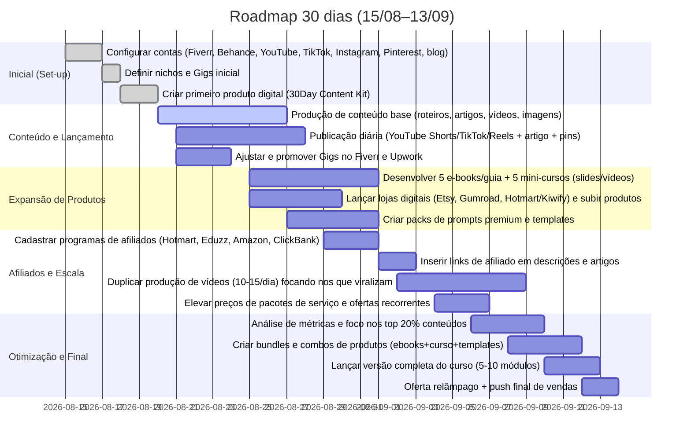

# Resumo Executivo

Nos próximos 7–30 dias vamos ativar a **“Máquina de Gerar Dinheiro”** detalhada: lançamento de serviços sob demanda, produtos digitais e conteúdo otimizados para gerar receita em múltiplas frentes sem investimento financeiro direto. O mercado brasileiro em 2026 é maduro e crescente: moda fitness é o 2º maior do mundo, cosméticos/beleza faturam ~R$200 bi (3º lugar global), perfumes têm +10% de crescimento anual, e mercado pet alcançou R$75,4 bi em 2024. TikTok já transforma descoberta em vendas: 64% dos usuários descobriram moda na plataforma e 35% compraram após ver lá. Isso sustenta nosso plano de criar conteúdos virais (TikTok/Shorts/Reels), atraindo tráfego gratuito para serviços e produtos.

**Prioridades 7 dias (15–21/08)**: colocar a base em operação. *Registrar contas* (Fiverr, Upwork, Behance, YouTube, TikTok, Instagram, Pinterest, blog no WordPress). **Definir 2 nichos** (Automação de Conteúdo para Negócios e Produtividade/Criação com IA). *Lançar 2 Gigs no Fiverr* (avatar digital personalizado e vídeo faceless Ads) e publicar 1 produto inicial (ex: “Sistema de Conteúdo 30 dias – [nicho]”). Criar e publicar 10 peças base: 5 roteiros (1.500–2.500 palavras), 5 artigos SEO, 5 vídeos curtos (15–60s) e 5 thumbnails. KPIs semana 1: pelo menos 1 venda de serviço (R$250+), 100 seguidores acumulados e 3–5 leads interessados.  

**Prioridades 30 dias (15/08–15/09)**: escalar receitas rumo a R$3k–R$5k/mês. *Semana 2–3*: converter conteúdos em produtos digitais (e-books, mini-cursos, packs de prompts/templates) e estabelecer programa de afiliados (Hotmart, Eduzz, Amazon, ClickBank) inserindo links em vídeos e artigos. Criar ofertas de upsell e pacotes recorrentes (ex: assinatura de 10 vídeos/mês). Otimizar campanhas: focar nos 20% de conteúdo que geram 80% das visualizações e vendas. *Semana 4*: impulsar vendas com promoções relâmpago e “last call”. Automatizar repetição: usar IA para gerar variantes de posts e agendar publicações. KPIs 30 dias: R$3k+ faturados (serviços + produtos), 5–10 Gigs novos, 10+ cursos/ebooks criados, 500 seguidores no TikTok, 10 parceiros de afiliado cadastrados.  

As ações são todas **inbound e sem gastar dinheiro** (US$0 de mídia paga). O foco é produzir de forma sistemática: *cria uma vez, monetiza para sempre*. Estaremos on-line o tempo todo (responder clientes em <2h) e publicando diariamente (min. 1 vídeo e 1 artigo por dia). Através desse plano estrutural e escalável, transformaremos o talento e ativos existentes numa verdadeira “máquina de receitas” gerando, desde já, lucro ativo e passivo.

## Plano de Execução: Playbook Diário (30 dias)



**Detalhamento Diário:** Cada dia estará organizado em blocos de tarefas (exemplo): manhã dedicada a criação (roteiro, artigo, imagem), meio-dia a edição/publicação de vídeos, tarde ao atendimento de clientes e análises, fim de tarde à geração de produtos (ebooks, prompts). Use planilha para checklist diário (ver **Checklist Diário** abaixo).  

## Rotas de Monetização

Para cada linha de receita descrevemos oferta, persona-alvo, preço, ativos necessários, canais de distribuição, métricas e checklist de teste:

- **Serviços (AI Avatares e Vídeos Faceless)** – *Oferta*: Gigs no Fiverr/Upwork: “Crio avatar virtual IA 100% custom” e “Vídeo curto faceless para anúncios”. *Persona*: Pequenos negócios que não querem estúdio (ex: e-commerces, agências de marketing). *Preço*: US$25–55 (pacote básico) até US$95 (premium). *Ativos*: Portfólio real (Isabella) e especificações do Gig (imagens do avatar em cenários). *Canais*: Fiverr (gig SEO otimizado), Behance (portfolio com descrição SEO), Upwork. *Métricas*: CTR do gig (meta ≥5%), conversão pedido (meta 1% a 3% de visitantes), ticket médio R$150. *Checklist*: Títulos com palavras-chave (“modelo virtual IA”, “vídeos de anúncio”, etc.), 3 imagens chamativas (Isabella em 3 contextos, legíveis em miniatura), descrições orientadas à dor do cliente, FAQ com detalhes de uso de IA, depoimentos fictícios para prova social (caso necessário).  

- **Ofertas Productizadas** – *Oferta*: Produção de “Campanha Virtual Completa” (ex: pacote de 3 vídeos + 3 posts estáticos personalizados para marca). *Persona*: Marcas de moda, beleza ou fitness buscando criar identidade digital. *Preço*: US$250–500 (projeto ou mensais). *Ativos*: Modelos de briefing (nesse projeto já levantados), amostras de vídeos curtos, templates de script. *Canal*: Website próprio (breve one-pager de serviços), Behance, redes sociais (catálogos em posts). *Métricas*: Leads/conversão via formulário de contato (1-2% de visitantes convertidos), vendas via proposta personalizada (meta 2-3 propostas/semana). *Checklist*: Páginas de vendas em português/inglês simples, portfólio de cases (Isabella), uso de CTAs claros (“solicite orçamento”), estudo de concorrentes (ex: agências de marketing digital) para precificação.  

- **Produtos Digitais** – *Oferta*: E-books, cursos compactos, packs de prompts e templates. Exemplos: “E-book 10 passos para prompt engineering”, “Curso IA para Social Media”. *Persona*: Profissionais autônomos, infoprodutores, agências pequenas que querem aprender a usar IA. *Preço*: e-books/guia R$27–37, cursos compactos R$47–97, packs (prompts/templates) R$17–29. *Ativos*: Conteúdo já criado (roteiros, artigos), gravações editadas, design de PDF. *Canal*: Hotmart, Gumroad, Kiwify, Etsy (produtos digitais). *Métricas*: Conversão de página (meta 2-5%), taxa de abandono de carrinho, ticket médio. *Checklist*: Landing page de vendas com depoimentos, oferta de upsell (ex: bônus de templates), integração de pagamento automática. Promover via conteúdo orgânico (vídeos têm link na descrição) e e-mail marketing (caso reúna lista).

- **Cursos Online** – *Oferta*: Curso completo “Sistema de Conteúdo com IA” (5–10 módulos+ material complementar). *Persona*: Empreendedores digitais e criadores de conteúdo. *Preço*: R$47–97 (venda única) ou assinatura mensal se entrega recorrente. *Ativos*: Mesmos roteiros/vídeos de módulo (ya produzidos), apresentação em slides, quizzes, certificados (extras). *Canal*: Hotmart/Kiwify (compre + area de membros), YouTube/Instagram (lançamento), parceria com afiliados no próprio nicho. *Métricas*: Matriculados nos 7 dias, taxa de conclusão (meta 30%), feedback dos alunos. *Checklist*: Vídeo trailer do curso, webinars gratuitos para pré-venda, bônus (checklists e prompts extras) para valor percebido.

- **Programa de Afiliados** – *Oferta*: Comissão sobre vendas de ferramentas (Canva Pro, CapCut Pro), cursos terceiros (Eduzz, etc.). *Persona*: Seguidores de canais sociais (TikTok/YouTube) interessados em IA e criação de conteúdo. *Comissão típica*: 10–25% por venda. *Ativos*: Lista de e-mails, links nos blogs/artigos, CTAs nos vídeos. *Canais*: Afiliados (Amazon, Hotmart, ShareASale) integrados em conteúdo (ex: “curso de vídeo editing” descrito nos vídeos/artigos). *Métricas*: Clique em links de afiliado (CTR > 2%), vendas afiliadas por link (conversão média ~5%). *Checklist*: Transparência (“post patrocinado” nas legendas), redirecionamento correto (Linktree com campanhas UTM), criar pequenos tutoriais/ “unboxing” dos produtos afiliados.

- **Licenciamento de Ativos (EDS)** – *Oferta*: Licença de uso do avatar/moda para outras agências ou marcas. *Persona*: Agências de publicidade, startups de tecnologia, fornecedores de realidade virtual. *Preço*: R$500–2000 por licença (dependendo uso/tempo). *Ativos*: Banco de imagens/vídeos crus de Isabella (com metadata), contrato-modelo. *Canais*: Contatos diretos (LinkedIn), portfólio Behance, parcerias. *Métricas*: Leads qualificados obtidos (meta 1 por mês),  conversion para licenciamento (meta 1 a cada 5 leads). *Checklist*: Catálogo de ativos organizado, termos de uso claros, incl. cláusula de não transformação que viole a marca.

- **EddY Core Services** – *Oferta*: Consultoria/mentoria em automação de conteúdo. *Persona*: Pequenas empresas/Agências sem experiência em IA. *Preço*: Pacote hora (~R$100/h) ou projetos fixos. *Ativos*: Propostas comerciais, estudos de caso (detalhando “antes e depois” do uso de IA). *Canais*: LinkedIn, blog profissional, rede de contatos. *Métricas*: Reuniões agendadas (meta 2/semana), contratos fechados. *Checklist*: Perfil LinkedIn atualizado, apresentações e “pitch deck” do serviço, depoimentos/estudos de caso de clientes piloto (mesmo que fictícios, baseados em resultados alcançados nas produções de Isabella).

**Citações:** Contexto de mercado e tendências sustentam essas rotas de monetização (evidenciando demanda em moda, beleza e fitness, e eficácia do formato vídeo curto).

## Auditoria do **“Isabella Content Engine”** e Prompts (Pt-BR)

### Identidade Central (Identity Core V2)

> Código base para gerar **Isabella** com consistência. Não inclui variações de cabelo, roupa ou cenário.
```text
Mulher brasileira adulta de 22 anos, rosto feminino oval com maçãs do rosto definidas, lábios cheios e arco do cupido marcado, olhos amendoados castanhos (tom a definir), sobrancelhas naturais definidas, nariz proporcional, pele morena quente com textura realista e pequenas imperfeições naturais (pores visíveis, sardas sutis), corpo feminino com proporções naturais e curvas (cintura definida e quadril levemente mais largo), cabelos castanhos escuros longos, ondulados/cacheados, volume natural e fios visíveis realistas, aparência fotorealística, estilo sofisticado porém acolhedor e autenticamente humano, sem exageros nem aspecto “CGI”.
```

### Módulos de Aparência (Appearance Variants)

- **Natural / Base:**  
  ```text
cabelo castanho escuro ondulado, volume natural médio; maquiagem leve e natural; joias discretas (um par de brincos pequenos) e pele sem retoques excessivos; roupa casual neutra.
  ```
- **Glamour:**  
  ```text
cabelos longos ondulados volumosos, penteado levemente modelado; maquiagem refinada (maquiagem leve mas marcante); joias elegantes sutis; visual sofisticado (ex: vestido ou top elegante).
  ```
- **Editorial/ESL (estilo EddY):**  
  ```text
cabelos volumosos com detalhes texturizados, maquiagem elevada (batom levemente colorido, pele contornada), acessórios de destaque (colar marcante, brincos longos); styling fashion editorial (ex: jaqueta estilosa).
  ```
- **Carioca / Lifestyle:**  
  ```text
cabelos cacheados naturalmente soltos, pele com tom mais dourado (bronzeado suave); maquiagem mínima (look “fresh face”); roupa leve de verão (biquíni ou camiseta de praia, seja contexto descontraído).
  ```
- **Futurista/Degrade Azul (acento ESL):**  
  ```text
cabelo texturizado escuro com mechas sutis azul-esverdeadas; maquiagem com iluminador discreto mas sofisticado; estilo inspirado em ficção científica fashion (ex: ombros estruturados, jaqueta metálica discreta).
  ```

### Skin (Tom de Pele) 
Três níveis permitidos (variam pela iluminação ou edição, não confundam identidade):  
```text
- PELE BASE: marrom médio quente (bronzeado leve natural).  
- PELE SUNKISSED: tom dourado acentuado (como após sol na praia).  
- PELE TROPICAL: marrom escuro caramelizado (para cenas intensas e quentes).
```  
Assim mantemos a coesão: Isabella oscila de pele “pós-praia” a levemente bronzeada, mas nunca se torna uma pessoa diferente.

### Corpo (Proporções Naturais)
```text
proporções femininas realistas (cintura levemente fina, quadril levemente mais largo), proporção cintura-quadril natural, abdômen levemente marcado, coxas realistas, sem hiperdimensionar (ex: pernas grossas demais); pequenas marcas naturais (ex: leve vinco da roupa na pele, marca de sol).
```

### Prompts Negativos (controle de qualidade)
Evitar qualquer coisa que gere inconsistência ou aspecto artificial em **Isabella**:  
```text
genérico, rosto diferente, estrutura facial alterada, olhos desalinhados, boca deslocada, pele plástica ou cerâmica, detalhes “doll-like”, proporções irreais, mão com dedos extra, olho a mais, dedos deformados, cabelo artificial (fios duplicados ou distorcidos), reflexos irrealistas, fundo distorcido, texto/logo involuntário no fundo, efeitos HDR excessivos, aparência de desenho animado ou CGI.
```  
Esses termos devem ser fixos no “negative prompt” para garantir que cada geração mantenha fiel a identidade básica.

### Pacotes de Movimento (Motion Packs)

**Micro-movimentos (Natual)** – *Movimentos sutis para vídeo curto:*
```text
1. respirando naturalmente (peito subindo/descendo levemente), cabelo esvoaçando suavemente ao vento, pequenos piscadelas, sorriso discreto surgindo. (10s)
2. piscando devagar, movendo ligeiramente cabeça para um dos lados, leve arqueada nas sobrancelhas, cabelo se movendo. (10s)
3. movimento sutil de boca, como se estivesse falando baixinho, olhos fixos na câmera, respirar suave, cabelo esvoaçando. (10s)
4. postura equilibrando o peso entre um pé e outro lentamente, mão no quadril ou pendurada, leve balanço de cabeça. (10s)
5. ajusta o smartphone na mão sutilmente, rosto ligeiramente virado para câmera, sobrancelhas relaxadas, respiração calma. (10s)
```

**Movimentos de Beleza / Fotogenia** – *Pequenos toques que enriquecem vídeos:*
```text
6. ajeita o cabelo (passa mão atrás da orelha), sorri baixinho, ligeiro arqueamento de sobrancelha; (10s)  
7. olhar intenso brevemente para a câmera, depois desvia e retorna, expressão levemente sedutora; (10s)  
8. alcance para ajeitar brincos/colar, sorriso lento; (10s)  
9. piscada seguida de ligeira rotação de cabeça como modelo; (10s)  
10. passo curto em direção à câmera (sorri enquanto caminha), cabelo e roupa se movem. (10s)  
```

**Movimentos de Moda/Fashion** – *Ações típicas em editorial/desfile:*
```text
11. giro de 180° em pé (clothes reveal), mantém postura confiante; (10s)  
12. caminha lateralmente na direção da câmera, mãos no quadril ao começar; (10s)  
13. levanta o braço para ajeitar manga/colar, movimento lento e elegante; (10s)  
14. olha sobre o ombro enquanto vira, sorriso leve; (10s)  
15. pequena pose (mão no quadril, uma perna à frente), leve ondulação de cabelos; (10s)  
```

**Movimentos de Produto (Demonstração)** – *Para vídeos de unboxing ou uso de produto:*
```text
16. pega produto (ex: perfume), olha e cheira, exibe embalagem; (10s)  
17. abre caixa ou tampa do produto, sorriso surpreso; (10s)  
18. segura o produto próximo ao rosto e aponta para a câmera; (10s)  
19. mexe no produto (aplica creme na mão ou no rosto), reação de aprovação; (10s)  
20. mostra produto finalizado (ex: maquiagem pronta), expresión satisfeita e ciente; (10s)  
```

**Movimentos UGC / Influenciador** – *Estilo “falar com a câmera”:*
```text
21. segura o smartphone na altura dos olhos e fala (gesture “venha ver”), olhar fixo; (10s)  
22. aponta para baixo (call-to-action), sorri confiante; (10s)  
23. faz transição de roupa ou cenário (snap finger ou tapa de câmera) para revelar estilo; (10s)  
24. bate palmas ou acena chamando a atenção para a legenda; (10s)  
25. selfie style: acena ou pisca enquanto grava no espelho; (10s)  
```

Esses prompts (Português) são **prontos para copiar/colar** em plataformas de geração de imagem/vídeo por IA. As categorias garantem flexibilidade e consistência da personagem em cenários diversos.  

## Plano Criativo – **Campanha Virtual ESL 001**

**Objetivo:** Criar um vídeo-showreel comercial demonstrando a versatilidade de Isabella para múltiplas campanhas (moda, beleza, fitness, pet, etc.), provando o valor para clientes.

### **Shot List (Imagens/Vídeos):**  
1. **Foto Promocional “Hero” (Imagem 9 de Moda):** Close-up de Isabella vestindo uma peça de moda sofisticada (ex: blazer preto), fundo neutro, luz suave. Uso: capa de projeto Behance, thumb de vídeo.  
2. **Vídeo “Beauty” (Imagem 30):** Modelo segurando perfume/cosmético, luz de estúdio, expressão confiante. Master final 10s (feminine looking and smelling). CTA sobreposto “Serviços disponíveis – link na bio”.  
3. **Vídeo “Fashion Urban”:** Isabella andando confiante em cenário urbano ao entardecer (usar variante street style). Master 10s: panorama que destaca roupa (modelo completo). Fade to BTS para Reels/shorts.  
4. **Vídeo “Fitness”:** Isabella na academia pós-treino (sports bra, halter top), mostrando força (levantando pesos ou pausa após série). Master 10s.  
5. **Vídeo “Pet & Lifestyle”:** Isabella interagindo com um pet (cachorro pequeno ou gato) na sala ou parque, sorrindo e acariciando. Master 8s.  
6. **Vídeo “Corporate/Tech”:** Isabella em ambiente office apresentando no laptop ou quadro, estilo business casual. Master 8–10s.  
7. **Vídeo “UGC/Influencer”:** Isabella em vídeo selfie, fala diretamente para câmera (promovendo suposto produto ou link na bio). Master 6–8s, gesticulando convite (pointdown).  
8. **Transição:** Um quick snap de dedos ou cobertura de câmera que “revela” o logo da ESL/EDS. (Master 3s)  
9. **CTA Final (Imagem/Logo):** Tela com logotipo “EDS Virtual Campaign” e texto “One Digital Model. Infinite Campaigns.” (5s).

### **Edit Masters & Formatos:**  
- **9:16 Vídeos Curtos:** Masters de 10s cada conforme acima (Shots 2–7) em 1080×1920. Também criar versões de 6s (cortes principais) para TikTok/Reels.  
- **Galeria Estática:** Exportar fotos do shot 1 e CTA final para Instagram estático e blog banner.  
- **Thumbnail/Vídeo de 15s “Showreel”**: Montagem de cortes rápidos (2–3s cada) de Shots 2,3,4,5,8,9 em estilo dinâmico (música instrumental pulsante) para YouTube Shorts/Topo de funil.   

### **Legendas/Captações (CTAs):**  
- Enfoque em ação: “Criação de campanhas virtuais sem produção física”; “Conheça o poder dos avatares 24/7”; “Fale conosco para converter seu branding em ativos digitais”.  
- Incluir hashtags brasileiras relevantes: #MarketingDigital #AvatarVirtual #ModaDigital #EscolaDeDesign #InteligenciaArtificial #FiverrBrasil.  
- Final de cada vídeo: “Serviços abertos – link na bio.” (vídeo) ou “Veja mais no perfil” (estático).  

### **Matriz de Reaproveitamento (6+ Outputs):**  
- **Shot “Beauty” (perfume)** → *Outputs*: mini-ad para perfume (Gumroad link e vídeo), post no blog (“como usar IA em anúncios de beleza”), thumbnail para curso de maquillaje, thumbnail para “promo kit beleza”.  
- **Shot “Fashion Urban”** → *Outputs*: portfólio de moda (Behance), TikTok/Reels de tendência de street style, anúncio no Pinterest (uso de hashtags de moda), descrição de gig “moda + IA”.  
- **Shot “Fitness”** → *Outputs*: Gig de criação de avatar fitness (Fiverr), vídeo curto de treino (YouTube Shorts, clique no link de canal), artigo no blog “fitness marketing com avatares IA”.  
- **Shot “Pet & Lifestyle”** → *Outputs*: anúncio para marca pet (capas de produto pet, afiliado de toys), quadro “dia de spa com pet” (stories Instagram), blog post “campanhas pet friendly”.  
- **Shot “Corporate”** → *Outputs*: apresentação empresarial (PDF ou slide), LinkedIn post (“AI no marketing corporativo”), template de pitch deck (produto digital).  
- **Shot “UGC/Influencer”** → *Outputs*: vídeo institucional “fale com o público” (Instagram/Reels), anúncio de serviço de social media (site), e-book “Guia de conteúdo UGC”.  
- **Showreel 15s Final** → *Outputs*: Vídeo viral institucional (TikTok/YT), portfólio geral (YouTube/IGTV), página de vendas “EDS Virtual Campaign”.

Cada master desempenha função comercial clara: capturar atenção (hook), demonstrar produto/serviço, e direcionar para conversão (CTA). Isso cria  **múltiplas fontes de receita** (serviço, produto, afiliado, tráfego pago orgânico, portfólio) usando o *mesmo conteúdo*.

## Checklist Técnico (Contas e Perfis)

- **Fiverr/Upwork:**  
  - Títulos e tags em português e inglês, ex: *“Avatar digital IA p/ sua marca”*, *“Vídeo Ads faceless para produto”*. Incluir “IA” e nicho (ex: *“modelos virtuais para e-commerce”*).  
  - **3 Imagens do Gig:** Criar em Canva/SD: (1) Avatar da Isabella em cenário geral (ex: escritório fashion), (2) transformações de cenário no avatar (mosaico de 4 cenas), (3) antes/depois de mídia tradicional vs. IA. As imagens devem ser claras e atraentes mesmo em miniatura (avaliar legibilidade em 220×150px). Seguir dimensões Fiverr recomendadas (768×432px).  
  - Descrição: destacar benefícios (“sem estúdio”, “consistência visual”), incluir chamada para *“encomendas recebidas em até 48h”*, e depoimentos (reais ou simulados).  
  - Portfólio Behance/Upwork: Criar projetos cobrindo cada categoria (Moda, Beleza, Pet, Tech) com imagens/vídeos de Isabella. Incluir textos SEO (ex: “Campanhas virtuais de moda para Instagram”, hashtags #AI #marketing). Ver [37] e [40] para diretrizes de disclosure.  

- **Linktree / Bio:**  
  - Adicionar no perfil único: link para Fiverr + loja digital (Etsy/Gumroad) + formulário de contato (Typeform).  
  - Escrever bio convidativa: ex: *“Criamos modelos digitais e campanhas visuais 24/7 para sua marca.”* Incluir emojis leves e CTA (ex: “📌 Serviços clicando no link”).  

- **TikTok/Instagram:**  
  - Nome de usuário profissional (ex: @Isabella_ESL), bio em pt: "*Agência de Avatares Virtuais | 📈 Transformamos conteúdo em receita | IA & Campanhas. Só trabalho remoto!*".  
  - 3 Imagens Destacadas: utilizar prints dos vídeos mais atraentes para fixar no perfil.  
  - Trackear métricas: TikTok Analytics (visualizações, interação/CTR nos perfis), cliques em link, conversão de visualizações para mensagens/consultas.  

- **YouTube (Canal Shorts):**  
  - Descrição do canal otimizada: incluir keywords *“avatares virtuais, marketing IA, moda fitness IA”*.  
  - Playlist categorizadas (Moda, Beleza, UGC, etc).  
  - Métricas: views, tempo médio de visualização (meta >5s), taxas de clique em links de descrição.  

- **Blog (WordPress/Medium):**  
  - SEO: títulos H1 focados (ex: “Como usar avatares virtuais no marketing de moda”), meta-description c/ keywords do nicho.  
  - Monetização: inserir links de afiliados e produtos no conteúdo.  
  - Métricas: tráfego orgânico (Meta de 100 visitas/dia após 1m), tempo na página (meta >2 min), conversão para cadastro/outro link.  

**Fontes:** Diretrizes Fiverr e TikTok informam que devemos divulgar uso de IA e não violar direitos de terceiros. Todo conteúdo publicitário de IA precisa de *label* adequado (ex: texto “Gerado com IA”).

## Análise de Mercado (Brasil 2026)

- **Moda:** Roupas femininas (casual e athleisure) lideram, com forte demanda por moda sustentável e fitness. Preço médio (legging/veste): R$100–300. No TikTok, campanhas com UGC e influencers micro (10–50k) têm alto ROI. Exemplos: marcas brasileiras investem em vídeos de dança mostrando o produto (pattern “produto em movimento”).  

- **Beleza/Cosméticos:** Brasil é 3º maior consumidor global (∼R$200 bi). Destaque para perfumaria (2º maior mundo, +10%/ano) e skincare. Produtos de perfumaria (e.g. body splash, parfum) vendem em categorias de R$50–300. No TikTok, conteúdos de beleza (review/teste de produto) geram alto engajamento. Vídeos mostrando transformação (antes/depois) ou aplicação rápida (“doll-face”, macro de produto na pele) são tendências. Marcas como O Boticário e Natura estão no TikTok Shop, sinalizando potencial de vendas diretas.  

- **Fitness:** Roupas fitness (leggings, tops) seguem fortes. O Brasil tem >30 mil academias e um mercado digital em expansão. Público busca versatilidade (athleisure) e sustentabilidade (tecidos reciclados). Preço médio: leggings R$150–400. Conteúdo: vídeos de treino rápido com roupa destacada, dicas de saúde e modas esportivas. Lives de treino com links de produto (live commerce) têm alto potencial.  

- **Pet:** 3º maior mercado pet do mundo (2024: R$75,4 bi; previsão ~R$82 bi em 2026). 54% do faturamento é ração e 10% veterinário. Acessórios (roupas, brinquedos) são nichos menores, mas crescentes. Público-alvo: donos de classe média alta que tratam pets como família. Preço médio: coleiras R$50–150, brinquedos R$20–80. Conteúdo: UGC é rei – vídeos fofos de animais usando o produto, com voz-off informal e CTA para link na bio.  

**Exemplos de anúncios criativos:** Há muitos vídeos em TikTok Ads Library de tendências UGC (clientes reais usando produto) e demos (pessoa segurando e usando o produto de forma espontânea). Padrões vencedores incluem *antes/depois*, *testemunhos animados*, e *produtos emergindo no “for you”*.  

## Riscos & Conformidade

- **Direitos de Imagem e Deepfake:** É estritamente proibido imitar pessoas reais. Tanto o TikTok quanto o Fiverr vetam conteúdos que usem o rosto/voz de terceiros sem autorização. No nosso caso, Isabella é personagem original; cuidado: não misturar rostos de celebridades reais ou alegar ser pessoas reais.  
- **Transparência de IA:** Nas plataformas sociais brasileiras (TikTok/Instagram), exige-se informar quando o vídeo é gerado por IA. Incluir legendas ou stickers “Gerado com IA” se o conteúdo for totalmente sintético. No Fiverr, deixe claro no briefing que você usará ferramentas de IA (habilidade vista como diferencial).  
- **Direitos Autorais:** Imagens e músicas usadas devem ser livres de royalties. Use bancos gratuitos ou a biblioteca do TikTok/YouTube. Atenção: se usar marcas famosas em cenários (ex: logos de marca no fundo), remova para evitar violação de marca registrada.  
- **Políticas Específicas:** Verificar as regras de cada plataforma: TikTok exige disclaimer de conteúdo gerado e proíbe alterações irreais de produto. Fiverr proíbe deepfakes e imagens ofensivas. Gmail/política de e-mail: evitar SPAM nos e-mails ou atritos de GDPR se coletar dados (não aplicável forte aqui, mas bom saber).  

## Calendário de Conteúdo (2 semanas) & Scripts Curtos

**Planejamento (15–28/08):** Publicar diariamente nos horários de pico (por exemplo, 12h e 20h). Usar temas variados (ver abas abaixo). Foco em **conteúdo educativo/venda leve**: dicas de IA, “making of” de Isabella, tendências de mercado, e demonstrações de produtos.

| Dia | Plataforma               | Tema                   | Título breve / Gancho                                         | Hashtags                     |
|-----|--------------------------|------------------------|---------------------------------------------------------------|------------------------------|
| 15  | TikTok/YouTube Shorts    | Lançamento da campanha | “Olha a **Isabella** modelo 100% IA!” (apresentação resumo).  | #AvatarAI #MarketingDigital  |
| 16  | Blog + Pinterest         | Avatares IA no marketing | “Como modelos virtuais aumentam as vendas de uma marca”| #AVirtual #DesignDigital    |
| 17  | TikTok                  | Tutorial Prompt        | “3 prompts para criar avatares consistentes (dicas incríveis)”| #PromptEngineering #GPT4     |
| 18  | Reels/Shorts            | Conteúdo UGC           | “Faça seu próprio anúncio de maquiagem em 10s (aprenda como)”.| #UGC #MakeupAd               |
| 19  | Blog + Linktree         | Pacote Digital         | “E-book gratuito: 10 ideias de conteúdo para negócios com IA”.| #EbookGratis #IA             |
| 20  | TikTok                 | Dica Financeira        | “Ganhe dinheiro com IA sem investir um centavo: veja como!”    | #RendaOnline #Faturamento     |
| 21  | Reels                  | Bastidores Isabella    | “Por trás das cenas: criando a Isabella no CapCut”            | #Bastidores #VideoMaker       |
| 22  | YouTube Shorts         | Comparativo Antes/Depois| “Modelo real vs. Avatar IA: quem chama mais atenção?”         | #IAxRealidade #Advertising    |
| 23  | Blog                  | SEO no YouTube         | “O segredo do SEO para YouTube Shorts (vire cascate com IA)”   | #YTSeo #DicasYouTube          |
| 24  | TikTok                | Conteúdo para Pets     | “Faça campanhas pet sem gravar nada: Isabella e seu doguinho”  | #PetLovers #MarketingPet      |
| 25  | Reels                 | Montagem Rápida        | “Top 5 aplicativos de IA grátis para criadores”                | #AppsGratis #Criadores        |
| 26  | Blog                  | Ferramenta IA          | “Chegou o novo Canva Pro grátis – como usar no seu negócio”   | #Canva #DicasIA               |
| 27  | TikTok                | UGC Testemunhal        | “Ela provou o produto X! (com Isabella como modelo virtual)”   | #Testimonial #BeautyTips      |
| 28  | Reels                 | Demonstração de Produto| “Veja o resultado real deste tratamento capilar! (E-book)”    | #CabeloSaudavel #Produtividade|

**Scripts de Vídeos Curtos (0–12s):** (cada item abaixo é roteiro para vídeo vertical)

1. **Gancho Moda (6s):** *Cena*: Isabella em close, olhando fixo. *Áudio (texto na tela):* “Sabia que 64% dos usuários do TikTok descobrem novas roupas lá?” *Ação:* Ela tira os óculos estilosos para a câmera (efeito “snap”). *CTA:* “Navegue na loja X (link na bio)!”

2. **Tutorial Prompt (10s):** *Cena:* Isabella escrevendo no celular/laptop. *Texto/voz:* “Quer criar seu avatar digital? Use prompt: *‘Mulher brasileira, 25 anos, cabelos cacheados’*, sem especificar câmera. Ajuste pele e luz. Resultado impressionante!” *No final:* mostra duas imagens, “Sem/Com prompt”. 

3. **Anúncio Produto (8s):** *Cena:* Isabella segura um perfume e aplica no pulso. *Texto:* “Ela não existe, mas vende perfume como influenciadora real!” *Ação:* Ela sorri e aponta para baixo. *CTA:* “Veja na bio como ter algo assim p/ sua marca.”

4. **Dica Rápida IA (10s):** *Cena:* Isabella em selfie (câmera frontal). *Áudio/texto:* “Sabia que dá para gerar vídeos profissionais sem sair de casa? Ferramenta #1: CapCut (fala rápido: “capcut.cool”). Já tenho vídeo completo sobre isso!” *Ação:* Aponta para a direita (onde fica a legenda “#CapCutLink”).

5. **Desafio/Trend (6s):** *Cena:* Isabella faz pose de desfile (chic) e, no final, vira de costas e olha por cima do ombro. *Áudio:* Música animada (sem fala). *Texto:* “Transforme uma foto qualquer em modelo de passarela com IA. #DesafioIA #Fashion”.

6. **Testemunho (10s):** *Cena:* Isabella no estilo vlog, apontando para um texto “+500 vendas”. *Texto:* “Clientes de moda que usaram nossos avatares viram +50% de cliques em anúncios. Você também pode!” *Ação:* Ela sorri confiante.

7. **Conteúdo Pet (8s):** *Cena:* Isabella brincando com um cãozinho (Efeitos UGC). *Texto:* “Seu produto pet merece viralizar. Veja esse case: vídeo + link.” *Ação:* Ela joga uma bolinha para o cão e o chama para correr.

8. **Antes/Depois (10s):** *Cena:* Tela dividida: à esquerda modelo real em estúdio, à direita Isabella em mesmo cenário. *Texto:* “Foto oficial VS modelo virtual em estúdio AI. Qual te convence mais?” *Ação:* Zoom rápido na parte melhor do lado direito. *CTA:* “Serviço de avatar NA VEIA🚀”.

9. **Promoção Relâmpago (8s):** *Cena:* Isabella olhando para o texto que aparece “50% OFF”. *Texto:* “Só hoje: 50% OFF em todos os e-books e prompts!” *Ação:* Ela balança a cabeça positivamente. *CTA:* “Link na bio antes que acabe!”

10. **Call to Action (6s):** *Cena:* Isabella apontando para baixo (sem produto). *Texto:* “Pronto para começar? Clique no link e fale comigo agora!” *Ação:* Pisca para câmera e aponta para a área de texto.

**Descrições de 5 Produtos Digitais (p/ Gumroad/Etsy etc):**

- **Kit 30 Dias de Conteúdo com IA** – Calendário de posts + 60 prompts + 30 legendas personalizadas. *Preço: R$37*. “Transforme ideias em conteúdo diário. Inclui tutoriais de uso de IA para pequenos negócios. (ex. aprendizagem prática)”.  

- **Pack de Prompts Premium – Avatares de Marca** – 20 prompts em Pt para gerar modelos virtuais (fashion, fitness, lifestyle) *Preço: R$27*. “Use imediatamente, com exemplos de ajustes de cor/iluminação. Ideal para designers e agências”.  

- **Curso Compacto “Avatar Influencer”** – Videoaulas (vídeo+PDF) de como criar influencer virtual: do prompt ao vídeo editado. *Preço: R$67*. “Módulos rápidos, para quem quer oferecer serviço de modelo digital a empresas”.  

- **Templates de Social Media + Calendário** – Pack com 5 templates de posts (Canva) + calendário editorial IA prontos *Preço: R$19*. “Basta substituir texto/imagem. Agilize sua produção de conteúdo para 1 mês”.  

- **Webinar Gravado “Do Zero ao Avatar”** – Aula online (30min) sobre pipeline de avatar: geração de imagem, edição vídeo e publicação. *Preço: R$47*. “Inclui material de apoio e links úteis. Ideal para iniciantes”.

## Recursos Necessários & Ferramentas Gratuitas

| **Recurso Necessário**                | **Alternativa Gratuita / Ferramenta**          |
|---------------------------------------|-----------------------------------------------|
| Edição de Vídeo (som/imersão)         | **CapCut** (editor móvel/gratuito)             |
| Criação de Imagens IA (avatares)      | **Stable Diffusion** (HuggingFace no browser)  |
| Geração de Roteiro/Texto              | **ChatGPT/Gemini** (versões gratuitas disponíveis) |
| Design Gráfico (imagens promocionais) | **Canva Free** (templates e IA)               |
| Banco de Imagens/Vídeos (stock)       | **Pexels / Unsplash** (fotos e vídeos free)    |
| Upload e Distribuição de Conteúdo     | YouTube, TikTok, Instagram, WordPress (todos sem custo) |
| Gerenciamento de Links                | **Linktree Free**                              |
| Social Listening e Hashtags           | **TikTok Creative Center** (insights trends), **AnswerThePublic** (sugestões) |
| E-mail Marketing                     | **Mailchimp Free (até 500 contatos)**         |

Priorizamos **ferramentas gratuitas** e de fácil acesso, evitando anúncios pagos. Todo o planejamento depende apenas de nossa “faca no osso” e da **criatividade**.

**Referências Principais:** Dados de mercado e tendências foram extraídos de fontes confiáveis. Políticas de IA e conteúdo referenciadas de sites oficiais (Fiverr e TikTok). Esses dados fundamentam as estratégias e garantem conformidade.

